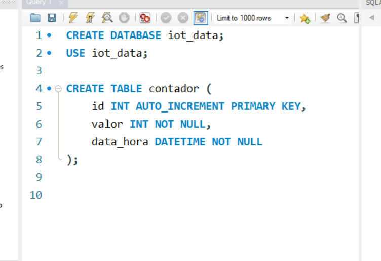

# IoT

**Projeto IoT**

**Introdução a Bancos de Dados para IoT**

Objetivo: Armazenar leituras de sensores.

Conteúdo Teórico:
Bancos relacionais (MySQL, SQLite)
Bancos NoSQL (Firebase)
Conceito de API intermediária para gravação

Atividade Prática:
Criar API em Flask que recebe dados do ESP32 e armazena em SQLite.

Materiais:
Computador com Python instalado
ESP32 com conexão Wi-Fi

# Etapa 1 – Entendendo o fluxo

O ESP32 não se conecta diretamente a MySQL ou MongoDB na maioria dos casos — ele envia os dados para um servidor intermediário (API), e esse servidor grava no banco.

O fluxo fica assim:
ESP32  →  API (Python Flask)  →  Banco de Dados (MySQL ou MongoDB)

E para visualizar os dados:
Navegador → API → Banco → retorna dados


# Etapa 2 – Preparando o ambiente no Windows 11

Vamos instalar tudo que você vai precisar para MySQL e MongoDB.

1️⃣ Instalar Python (API intermediária)

Baixe e instale o Python 3.12 ou mais recente:
https://www.python.org/downloads/windows/

Marque a opção "Add Python to PATH" na instalação.

2️⃣ Instalar MySQL

Baixe o MySQL Community Server:
https://dev.mysql.com/downloads/mysql/

Instale e configure usuário root com senha (ex: 1234).

Instale também o MySQL Workbench (para gerenciar o banco visualmente).

3️⃣ Instalar bibliotecas Python

Depois que Python estiver instalado, no terminal do Windows (cmd ou PowerShell), rode:

pip install flask flask-cors mysql-connector-python

**Essas bibliotecas vão permitir:**

- Criar API (flask)
- Conectar no MySQL (mysql-connector-python)
- Permitir acesso web (flask-cors)


# Etapa 3 – Criando o Banco de Dados

💾 MySQL

Abra o MySQL Workbench e rode:


```sql
CREATE DATABASE iot_data;
USE iot_data;

CREATE TABLE contador (
    id INT AUTO_INCREMENT PRIMARY KEY,
    valor INT NOT NULL,
    data_hora DATETIME NOT NULL
);
```




# Etapa 4 – Criando a API Flask

Crie um arquivo api.py no Windows com este código:


```python
from flask import Flask, request, jsonify
import mysql.connector
from datetime import datetime

app = Flask(__name__)

# Configurar conexão MySQL
def get_db_connection():
    return mysql.connector.connect(
        host='localhost',
        user='root',
        password='SUA_SENHA',  # Troque pela sua senha
        database='flask_db'
    )

@app.route('/')
def home():
    return "API Flask + MySQL funcionando!"

@app.route('/salvar', methods=['POST'])
def salvar():
    dados = request.get_json()
    valor = dados.get('valor')
    data_hora = datetime.now()

    conn = get_db_connection()
    cursor = conn.cursor()
    cursor.execute("INSERT INTO contador (valor, data_hora) VALUES (%s, %s)", (valor, data_hora))
    conn.commit()
    cursor.close()
    conn.close()

    return jsonify({"status": "ok", "valor": valor, "data_hora": str(data_hora)})

@app.route('/listar', methods=['GET'])
def listar():
    conn = get_db_connection()
    cursor = conn.cursor()
    cursor.execute("SELECT * FROM contador ORDER BY id DESC LIMIT 10")
    resultados = cursor.fetchall()
    cursor.close()
    conn.close()

    dados = []
    for linha in resultados:
        dados.append({
            "id": linha[0],
            "valor": linha[1],
            "data_hora": linha[2].strftime("%Y-%m-%d %H:%M:%S")
        })

    return jsonify(dados)


if __name__ == '__main__':
    app.run(host='0.0.0.0', port=5000, debug=True)


```

# Etapa 5 – Código do ESP32

O ESP32 vai:

Contar +1 a cada segundo.

Mostrar contador numa página web.

Enviar para a API /salvar.


```cpp

#include <WiFi.h>
#include <HTTPClient.h>

const char* ssid = "SEU_WIFI";
const char* password = "SENHA_WIFI";

const char* serverName = "http://SEU_IP_LOCAL:5000/salvar"; // IP do PC que roda a API

int contador = 0;
unsigned long ultimoMillis = 0;

void setup() {
  Serial.begin(115200);
  WiFi.begin(ssid, password);

  while (WiFi.status() != WL_CONNECTED) {
    delay(500);
    Serial.print(".");
  }
  Serial.println("Conectado!");
}

void loop() {
  unsigned long agora = millis();
  if (agora - ultimoMillis >= 1000) { // 1 segundo
    ultimoMillis = agora;
    contador++;
    Serial.println(contador);
    enviarParaAPI(contador);
  }
}

void enviarParaAPI(int valor) {
  if (WiFi.status() == WL_CONNECTED) {
    HTTPClient http;
    http.begin(serverName);
    http.addHeader("Content-Type", "application/json");

    String json = "{\"valor\":" + String(valor) + "}";
    int httpResponseCode = http.POST(json);

    if (httpResponseCode > 0) {
      String resposta = http.getString();
      Serial.println(resposta);
    } else {
      Serial.println("Erro ao enviar");
    }
    http.end();
  }
}

```

# Interface web, feita com HTML + Bootstrap + Chart.js, para visualizar o contador vindo do ESP32 em tempo real.

🚀 Estrutura do projeto

Você vai ter algo assim:

```bash
📁 seu_projeto/
│
├── api.py                 # Flask principal
├── templates/
│   └── dashboard.html     # Página web com o gráfico

```

# 🧠 Passo 1 — Código completo do api.py

Crie (ou substitua o atual) com este código:

```python

from flask import Flask, request, jsonify, render_template
import mysql.connector
from datetime import datetime

app = Flask(__name__)

# 🔹 Função para conectar ao banco
def conectar_banco():
    return mysql.connector.connect(
        host="localhost",
        user="seu_usuario_mysql",     # 🔸 altere aqui
        password="sua_senha_mysql",   # 🔸 altere aqui
        database="iot_data"
    )

# 🔹 Rota chamada pelo ESP32
@app.route('/salvar', methods=['POST'])
def salvar():
    data = request.get_json()
    valor = data.get("valor")

    conn = conectar_banco()
    cursor = conn.cursor()
    cursor.execute("INSERT INTO contador (valor, data_hora) VALUES (%s, %s)", (valor, datetime.now()))
    conn.commit()
    conn.close()

    return jsonify({"status": "ok"}), 200


# 🔹 Rota que retorna dados em formato JSON (para o gráfico)
@app.route('/api/dados')
def api_dados():
    conn = conectar_banco()
    cursor = conn.cursor(dictionary=True)
    cursor.execute("SELECT * FROM contador ORDER BY id DESC LIMIT 20")
    resultados = cursor.fetchall()
    conn.close()

    # Inverter para mostrar do mais antigo para o mais recente
    resultados.reverse()
    return jsonify(resultados)


# 🔹 Página web com o gráfico
@app.route('/')
def index():
    return render_template('dashboard.html')


if __name__ == '__main__':
    app.run(host='0.0.0.0', port=5000, debug=True)

```

# 🧩 Passo 2 — Crie a pasta templates e o arquivo dashboard.html

Dentro da pasta templates, crie um arquivo chamado dashboard.html com o conteúdo abaixo:

```html
<!DOCTYPE html>
<html lang="pt-br">
<head>
  <meta charset="UTF-8">
  <meta name="viewport" content="width=device-width, initial-scale=1.0">
  <title>Dashboard IoT - ESP32</title>
  <script src="https://cdn.jsdelivr.net/npm/chart.js"></script>
  <link href="https://cdn.jsdelivr.net/npm/bootstrap@5.3.0/dist/css/bootstrap.min.css" rel="stylesheet">
</head>
<body class="bg-light">
  <div class="container mt-5">
    <h2 class="text-center mb-4">📊 Monitoramento do Contador - ESP32</h2>
    <div class="card shadow">
      <div class="card-body">
        <canvas id="grafico"></canvas>
      </div>
    </div>
  </div>

  <script>
    const ctx = document.getElementById('grafico').getContext('2d');
    let grafico = new Chart(ctx, {
      type: 'line',
      data: {
        labels: [],
        datasets: [{
          label: 'Valor do Contador',
          data: [],
          borderColor: 'rgb(75, 192, 192)',
          tension: 0.2,
          fill: false
        }]
      },
      options: {
        responsive: true,
        scales: {
          x: { title: { display: true, text: 'Data/Hora' } },
          y: { title: { display: true, text: 'Valor' }, beginAtZero: true }
        }
      }
    });

    async function atualizarGrafico() {
      const response = await fetch('/api/dados');
      const dados = await response.json();

      grafico.data.labels = dados.map(d => new Date(d.data_hora).toLocaleTimeString());
      grafico.data.datasets[0].data = dados.map(d => d.valor);
      grafico.update();
    }

    setInterval(atualizarGrafico, 3000); // atualiza a cada 3 segundos
    atualizarGrafico(); // chama ao carregar
  </script>
</body>
</html>
```

# 🧠 Passo 3 — Executar o servidor Flask

No PyCharm (ou terminal), execute:

```bash
python api.py
```

Depois, acesse:
👉 http://127.0.0.1:5000/

Você verá o gráfico em tempo real sendo atualizado automaticamente conforme o ESP32 envia os dados.


# 📦 Ao instalar as versões compatíveis de:

mysql-connector-python (versão 9.0.0 ou superior)

mysql-connector (2.2.9)

e até PyMySQL (caso precise para outras libs)


